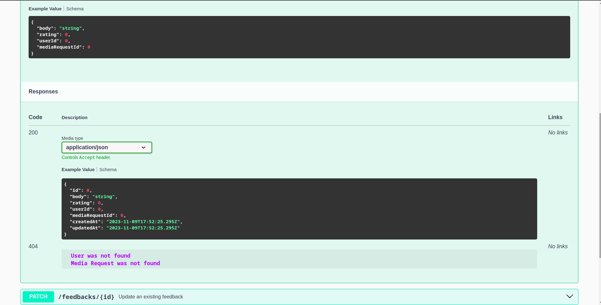
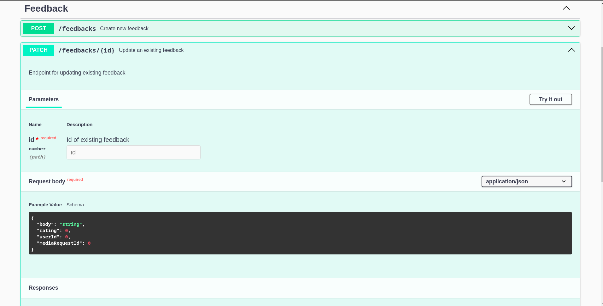
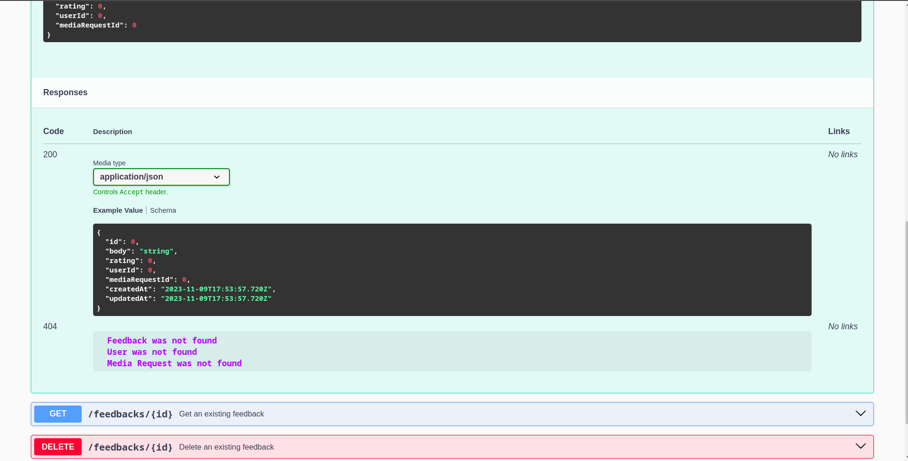
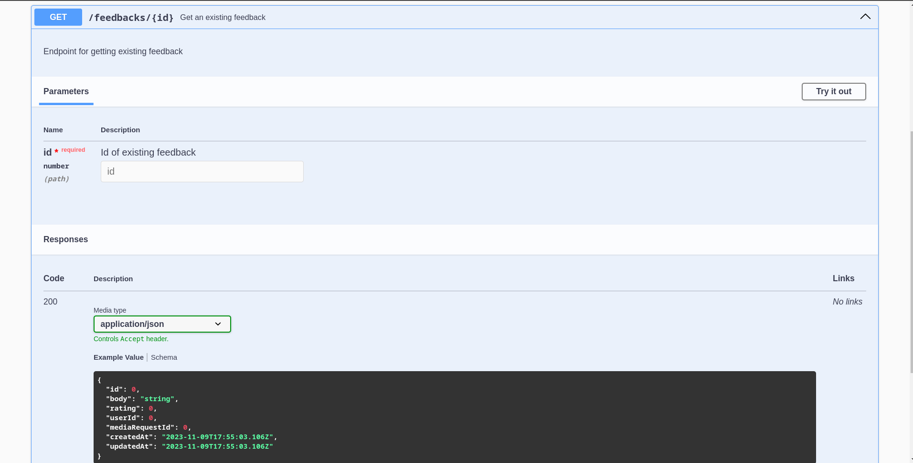
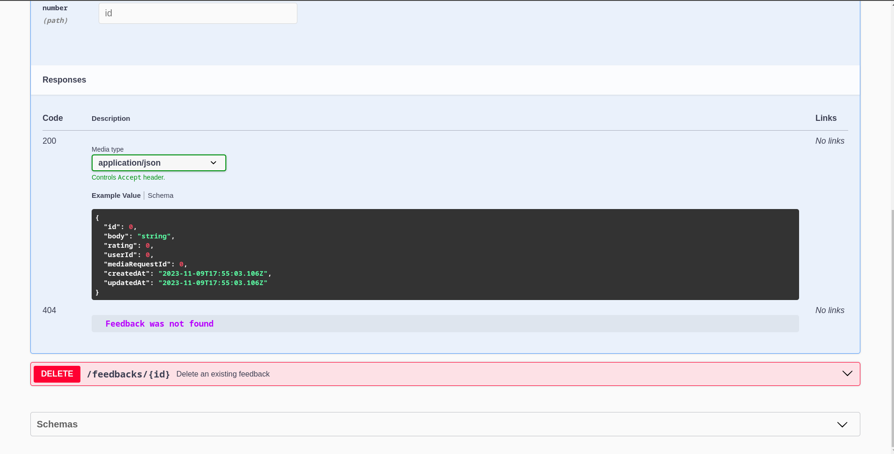
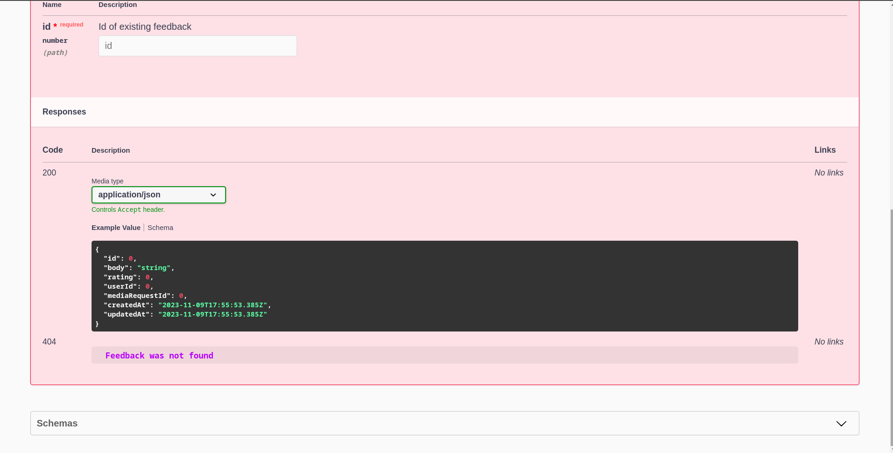

# Реалізація інформаційного та програмного забезпечення

## SQL-скрипт для створення початкового наповнення бази даних

```sql
-- MySQL Script generated by MySQL Workbench
-- Sun 05 Nov 2023 02:19:32 PM EET
-- Model: New Model    Version: 1.0
-- MySQL Workbench Forward Engineering

SET @OLD_UNIQUE_CHECKS=@@UNIQUE_CHECKS, UNIQUE_CHECKS=0;
SET @OLD_FOREIGN_KEY_CHECKS=@@FOREIGN_KEY_CHECKS, FOREIGN_KEY_CHECKS=0;
SET @OLD_SQL_MODE=@@SQL_MODE, SQL_MODE='ONLY_FULL_GROUP_BY,STRICT_TRANS_TABLES,NO_ZERO_IN_DATE,NO_ZERO_DATE,ERROR_FOR_DIVISION_BY_ZERO,NO_ENGINE_SUBSTITUTION';

-- -----------------------------------------------------
-- Schema mydb
-- -----------------------------------------------------

-- -----------------------------------------------------
-- Schema mydb
-- -----------------------------------------------------
CREATE SCHEMA IF NOT EXISTS `mydb` DEFAULT CHARACTER SET utf8 ;
USE `mydb` ;

-- -----------------------------------------------------
-- Table `mydb`.`action`
-- -----------------------------------------------------
DROP TABLE IF EXISTS `mydb`.`action` ;

CREATE TABLE IF NOT EXISTS `mydb`.`action` (
  `craeted_at` DATETIME NOT NULL,
  `state_id` INT NOT NULL,
  `media_request_id` INT NOT NULL,
  `source_id` INT NOT NULL,
  `user_id` INT NOT NULL,
  PRIMARY KEY (`state_id`, `media_request_id`, `source_id`, `user_id`),
  INDEX `fk_action_media_request1_idx` (`media_request_id` ASC) VISIBLE,
  INDEX `fk_action_source1_idx` (`source_id` ASC) VISIBLE,
  INDEX `fk_action_user1_idx` (`user_id` ASC) VISIBLE,
  CONSTRAINT `fk_action_state1`
    FOREIGN KEY (`state_id`)
    REFERENCES `mydb`.`state` (`id`)
    ON DELETE NO ACTION
    ON UPDATE NO ACTION,
  CONSTRAINT `fk_action_media_request1`
    FOREIGN KEY (`media_request_id`)
    REFERENCES `mydb`.`media_request` (`id`)
    ON DELETE NO ACTION
    ON UPDATE NO ACTION,
  CONSTRAINT `fk_action_source1`
    FOREIGN KEY (`source_id`)
    REFERENCES `mydb`.`source` (`id`)
    ON DELETE NO ACTION
    ON UPDATE NO ACTION,
  CONSTRAINT `fk_action_user1`
    FOREIGN KEY (`user_id`)
    REFERENCES `mydb`.`user` (`id`)
    ON DELETE NO ACTION
    ON UPDATE NO ACTION)
ENGINE = InnoDB;


-- -----------------------------------------------------
-- Table `mydb`.`based_on`
-- -----------------------------------------------------
DROP TABLE IF EXISTS `mydb`.`based_on` ;

CREATE TABLE IF NOT EXISTS `mydb`.`based_on` (
  `source_id` INT NOT NULL,
  `media_request_id` INT NOT NULL,
  PRIMARY KEY (`source_id`, `media_request_id`),
  INDEX `fk_source_has_media_request_media_request1_idx` (`media_request_id` ASC) VISIBLE,
  INDEX `fk_source_has_media_request_source1_idx` (`source_id` ASC) VISIBLE,
  CONSTRAINT `fk_source_has_media_request_source1`
    FOREIGN KEY (`source_id`)
    REFERENCES `mydb`.`source` (`id`)
    ON DELETE NO ACTION
    ON UPDATE NO ACTION,
  CONSTRAINT `fk_source_has_media_request_media_request1`
    FOREIGN KEY (`media_request_id`)
    REFERENCES `mydb`.`media_request` (`id`)
    ON DELETE NO ACTION
    ON UPDATE NO ACTION)
ENGINE = InnoDB;


-- -----------------------------------------------------
-- Table `mydb`.`feedback`
-- -----------------------------------------------------
DROP TABLE IF EXISTS `mydb`.`feedback` ;

CREATE TABLE IF NOT EXISTS `mydb`.`feedback` (
  `id` INT NOT NULL,
  `body` VARCHAR(255) NULL,
  `rating` FLOAT NOT NULL,
  `created_at` DATETIME NOT NULL,
  `updated_at` DATETIME NOT NULL,
  `media_request_id` INT NOT NULL,
  `user_id` INT NOT NULL,
  PRIMARY KEY (`id`, `user_id`, `media_request_id`),
  INDEX `fk_Feedback_MediaRequest1_idx` (`media_request_id` ASC) VISIBLE,
  INDEX `fk_Feedback_User1_idx` (`user_id` ASC) VISIBLE,
  CONSTRAINT `fk_Feedback_MediaRequest1`
    FOREIGN KEY (`media_request_id`)
    REFERENCES `mydb`.`media_request` (`id`)
    ON DELETE NO ACTION
    ON UPDATE NO ACTION,
  CONSTRAINT `fk_Feedback_User1`
    FOREIGN KEY (`user_id`)
    REFERENCES `mydb`.`user` (`id`)
    ON DELETE NO ACTION
    ON UPDATE NO ACTION)
ENGINE = InnoDB;


-- -----------------------------------------------------
-- Table `mydb`.`label`
-- -----------------------------------------------------
DROP TABLE IF EXISTS `mydb`.`label` ;

CREATE TABLE IF NOT EXISTS `mydb`.`label` (
  `tag_id` INT NOT NULL,
  `source_id` INT NOT NULL,
  PRIMARY KEY (`tag_id`, `source_id`),
  INDEX `fk_tag_has_source_source1_idx` (`source_id` ASC) VISIBLE,
  INDEX `fk_tag_has_source_tag1_idx` (`tag_id` ASC) VISIBLE,
  CONSTRAINT `fk_tag_has_source_tag1`
    FOREIGN KEY (`tag_id`)
    REFERENCES `mydb`.`tag` (`id`)
    ON DELETE NO ACTION
    ON UPDATE NO ACTION,
  CONSTRAINT `fk_tag_has_source_source1`
    FOREIGN KEY (`source_id`)
    REFERENCES `mydb`.`source` (`id`)
    ON DELETE NO ACTION
    ON UPDATE NO ACTION)
ENGINE = InnoDB;


-- -----------------------------------------------------
-- Table `mydb`.`media_request`
-- -----------------------------------------------------
DROP TABLE IF EXISTS `mydb`.`media_request` ;

CREATE TABLE IF NOT EXISTS `mydb`.`media_request` (
  `id` INT NOT NULL,
  `name` VARCHAR(255) NOT NULL,
  `description` VARCHAR(255) NULL,
  `keywords` VARCHAR(255) NULL,
  `type` VARCHAR(255) NOT NULL,
  `created_at` DATETIME NOT NULL,
  `updated_at` DATETIME NOT NULL,
  `user_id` INT NOT NULL,
  `source_id` INT NOT NULL,
  PRIMARY KEY (`id`, `user_id`, `source_id`))
ENGINE = InnoDB;


-- -----------------------------------------------------
-- Table `mydb`.`permission`
-- -----------------------------------------------------
DROP TABLE IF EXISTS `mydb`.`permission` ;

CREATE TABLE IF NOT EXISTS `mydb`.`permission` (
  `id` INT NOT NULL,
  `name` VARCHAR(255) NOT NULL,
  PRIMARY KEY (`id`))
ENGINE = InnoDB;


-- -----------------------------------------------------
-- Table `mydb`.`role`
-- -----------------------------------------------------
DROP TABLE IF EXISTS `mydb`.`role` ;

CREATE TABLE IF NOT EXISTS `mydb`.`role` (
  `id` INT NOT NULL,
  `name` VARCHAR(255) NOT NULL,
  `description` VARCHAR(255) NULL,
  PRIMARY KEY (`id`))
ENGINE = InnoDB;


-- -----------------------------------------------------
-- Table `mydb`.`role_has_permission`
-- -----------------------------------------------------
DROP TABLE IF EXISTS `mydb`.`role_has_permission` ;

CREATE TABLE IF NOT EXISTS `mydb`.`role_has_permission` (
  `role_id` INT NOT NULL,
  `permission_id` INT NOT NULL,
  PRIMARY KEY (`role_id`, `permission_id`),
  INDEX `fk_Role_has_Permission_Permission1_idx` (`permission_id` ASC) VISIBLE,
  INDEX `fk_Role_has_Permission_Role1_idx` (`role_id` ASC) VISIBLE,
  CONSTRAINT `fk_Role_has_Permission_Role1`
    FOREIGN KEY (`role_id`)
    REFERENCES `mydb`.`role` (`id`)
    ON DELETE NO ACTION
    ON UPDATE NO ACTION,
  CONSTRAINT `fk_Role_has_Permission_Permission1`
    FOREIGN KEY (`permission_id`)
    REFERENCES `mydb`.`permission` (`id`)
    ON DELETE NO ACTION
    ON UPDATE NO ACTION)
ENGINE = InnoDB;


-- -----------------------------------------------------
-- Table `mydb`.`source`
-- -----------------------------------------------------
DROP TABLE IF EXISTS `mydb`.`source` ;

CREATE TABLE IF NOT EXISTS `mydb`.`source` (
  `id` INT NOT NULL,
  `name` VARCHAR(255) NOT NULL,
  `url` VARCHAR(255) NOT NULL,
  PRIMARY KEY (`id`))
ENGINE = InnoDB;


-- -----------------------------------------------------
-- Table `mydb`.`state`
-- -----------------------------------------------------
DROP TABLE IF EXISTS `mydb`.`state` ;

CREATE TABLE IF NOT EXISTS `mydb`.`state` (
  `id` INT NOT NULL,
  `display_name` VARCHAR(255) NOT NULL,
  PRIMARY KEY (`id`))
ENGINE = InnoDB;


-- -----------------------------------------------------
-- Table `mydb`.`tag`
-- -----------------------------------------------------
DROP TABLE IF EXISTS `mydb`.`tag` ;

CREATE TABLE IF NOT EXISTS `mydb`.`tag` (
  `id` INT NOT NULL,
  `name` VARCHAR(255) NOT NULL,
  PRIMARY KEY (`id`))
ENGINE = InnoDB;


-- -----------------------------------------------------
-- Table `mydb`.`user`
-- -----------------------------------------------------
DROP TABLE IF EXISTS `mydb`.`user` ;

CREATE TABLE IF NOT EXISTS `mydb`.`user` (
  `id` INT NOT NULL,
  `first_name` VARCHAR(255) NOT NULL,
  `last_name` VARCHAR(255) NOT NULL,
  `username` VARCHAR(255) NOT NULL,
  `email` VARCHAR(255) NOT NULL,
  `password` VARCHAR(255) NOT NULL,
  `role_id` INT NOT NULL,
  PRIMARY KEY (`id`, `role_id`),
  INDEX `fk_User_Role1_idx` (`role_id` ASC) VISIBLE,
  UNIQUE INDEX `username_UNIQUE` (`username` ASC) VISIBLE,
  UNIQUE INDEX `email_UNIQUE` (`email` ASC) VISIBLE,
  CONSTRAINT `fk_User_Role1`
    FOREIGN KEY (`role_id`)
    REFERENCES `mydb`.`role` (`id`)
    ON DELETE NO ACTION
    ON UPDATE NO ACTION)
ENGINE = InnoDB;


SET SQL_MODE=@OLD_SQL_MODE;
SET FOREIGN_KEY_CHECKS=@OLD_FOREIGN_KEY_CHECKS;
SET UNIQUE_CHECKS=@OLD_UNIQUE_CHECKS;

-- -----------------------------------------------------
-- Data for table `mydb`.`permission`
-- -----------------------------------------------------
START TRANSACTION;
USE `mydb`;
INSERT INTO `mydb`.`permission` (`id`, `name`) VALUES (1, 'user.delete');
INSERT INTO `mydb`.`permission` (`id`, `name`) VALUES (2, 'user.role.promote');
INSERT INTO `mydb`.`permission` (`id`, `name`) VALUES (3, 'media.find');
INSERT INTO `mydb`.`permission` (`id`, `name`) VALUES (4, 'media.create');
INSERT INTO `mydb`.`permission` (`id`, `name`) VALUES (5, 'media.delete');
INSERT INTO `mydb`.`permission` (`id`, `name`) VALUES (6, 'media.edit');
INSERT INTO `mydb`.`permission` (`id`, `name`) VALUES (7, 'media.feedback.add');

COMMIT;


-- -----------------------------------------------------
-- Data for table `mydb`.`role`
-- -----------------------------------------------------
START TRANSACTION;
USE `mydb`;
INSERT INTO `mydb`.`role` (`id`, `name`, `description`) VALUES (1, 'User', 'An ordinary user of the system');
INSERT INTO `mydb`.`role` (`id`, `name`, `description`) VALUES (2, 'TechnicalExpert', 'Specialist in technical issues');

COMMIT;


-- -----------------------------------------------------
-- Data for table `mydb`.`role_has_permission`
-- -----------------------------------------------------
START TRANSACTION;
USE `mydb`;
INSERT INTO `mydb`.`role_has_permission` (`role_id`, `permission_id`) VALUES (2, 1);
INSERT INTO `mydb`.`role_has_permission` (`role_id`, `permission_id`) VALUES (2, 2);
INSERT INTO `mydb`.`role_has_permission` (`role_id`, `permission_id`) VALUES (1, 3);
INSERT INTO `mydb`.`role_has_permission` (`role_id`, `permission_id`) VALUES (2, 3);
INSERT INTO `mydb`.`role_has_permission` (`role_id`, `permission_id`) VALUES (1, 4);
INSERT INTO `mydb`.`role_has_permission` (`role_id`, `permission_id`) VALUES (2, 4);
INSERT INTO `mydb`.`role_has_permission` (`role_id`, `permission_id`) VALUES (1, 5);
INSERT INTO `mydb`.`role_has_permission` (`role_id`, `permission_id`) VALUES (2, 5);
INSERT INTO `mydb`.`role_has_permission` (`role_id`, `permission_id`) VALUES (1, 6);
INSERT INTO `mydb`.`role_has_permission` (`role_id`, `permission_id`) VALUES (2, 6);
INSERT INTO `mydb`.`role_has_permission` (`role_id`, `permission_id`) VALUES (1, 7);
INSERT INTO `mydb`.`role_has_permission` (`role_id`, `permission_id`) VALUES (2, 7);

COMMIT;


-- -----------------------------------------------------
-- Data for table `mydb`.`state`
-- -----------------------------------------------------
START TRANSACTION;
USE `mydb`;
INSERT INTO `mydb`.`state` (`id`, `display_name`) VALUES (1, 'Subscribe');
INSERT INTO `mydb`.`state` (`id`, `display_name`) VALUES (2, 'Unsubscribe');
INSERT INTO `mydb`.`state` (`id`, `display_name`) VALUES (3, 'Quarantine');

COMMIT;


-- -----------------------------------------------------
-- Data for table `mydb`.`tag`
-- -----------------------------------------------------
START TRANSACTION;
USE `mydb`;
INSERT INTO `mydb`.`tag` (`id`, `name`) VALUES (1, 'Sport');
INSERT INTO `mydb`.`tag` (`id`, `name`) VALUES (2, 'Science and Technology');
INSERT INTO `mydb`.`tag` (`id`, `name`) VALUES (3, 'Entertainment');
INSERT INTO `mydb`.`tag` (`id`, `name`) VALUES (4, 'Fashion and Style');
INSERT INTO `mydb`.`tag` (`id`, `name`) VALUES (5, 'Music');
INSERT INTO `mydb`.`tag` (`id`, `name`) VALUES (6, 'Food and Cooking');
INSERT INTO `mydb`.`tag` (`id`, `name`) VALUES (7, 'Tourism');
INSERT INTO `mydb`.`tag` (`id`, `name`) VALUES (8, 'Movies and Television');

COMMIT;

```

## RESTfull сервіс для управління даними

### Схема бази даних (ORM Prisma)

```
generator client {
  provider = "prisma-client-js"
}

datasource db {
  provider = "mysql"
  url      = env("DATABASE_URL")
}

model User {
  id            Int            @id @default(autoincrement())
  firstName     String         @map("first_name")
  lastName      String         @map("last_name")
  username      String         @unique
  email         String         @unique
  password      String
  role          Role           @relation(fields: [roleId], references: [id], onDelete: Cascade)
  roleId        Int            @map("role_id")
  actions       Action[]
  feedbacks     Feedback[]
  mediaRequests MediaRequest[]

  @@map("users")
}

enum RoleName {
  USER
  TECHNICAL_EXPERT
}

model Role {
  id          Int                 @id @default(autoincrement())
  name        RoleName
  description String?
  users       User[]
  permissions RoleHasPermission[]

  @@map("roles")
}

model RoleHasPermission {
  role         Role       @relation(fields: [roleId], references: [id], onDelete: Cascade)
  roleId       Int        @map("role_id")
  permission   Permission @relation(fields: [permissionId], references: [id], onDelete: Cascade)
  permissionId Int        @map("permission_id")

  @@id([roleId, permissionId])
  @@map("role_has_permission")
}

model Permission {
  id    Int                 @id @default(autoincrement())
  name  String
  roles RoleHasPermission[]

  @@map("permissions")
}

model Feedback {
  id             Int          @id @default(autoincrement())
  body           String
  rating         Float
  user           User         @relation(fields: [userId], references: [id], onDelete: Cascade)
  userId         Int          @map("user_id")
  mediaRequest   MediaRequest @relation(fields: [mediaRequestId], references: [id], onDelete: Cascade)
  mediaRequestId Int          @map("media_request)id")
  createdAt      DateTime     @default(now()) @map("created_at")
  updatedAt      DateTime     @updatedAt @map("updated_at")

  @@map("feedbacks")
}

model MediaRequest {
  id          Int        @id @default(autoincrement())
  name        String
  description String?
  keywords    String?
  type        String
  user        User       @relation(fields: [userId], references: [id], onDelete: Cascade)
  userId      Int        @map("user_id")
  feedbacks   Feedback[]
  sources     BasedOn[]
  actions     Action[]
  createdAt   DateTime   @default(now()) @map("created_at")
  updatedAt   DateTime   @updatedAt @map("updated_at")

  @@map("media_requests")
}

model BasedOn {
  source         Source       @relation(fields: [sourceId], references: [id], onDelete: Cascade)
  sourceId       Int          @map("source_id")
  mediaRequest   MediaRequest @relation(fields: [mediaRequestId], references: [id], onDelete: Cascade)
  mediaRequestId Int          @map("media_request_id")

  @@id([sourceId, mediaRequestId])
  @@map("based_on")
}

model Source {
  id            Int       @id @default(autoincrement())
  name          String
  url           String
  mediaRequests BasedOn[]
  labels        Label[]
  actions       Action[]

  @@map("sources")
}

model Label {
  source   Source @relation(fields: [sourceId], references: [id], onDelete: Cascade)
  sourceId Int    @map("source_id")
  tag      Tag    @relation(fields: [tagId], references: [id], onDelete: Cascade)
  tagId    Int    @map("tag_id")

  @@id([sourceId, tagId])
  @@map("labels")
}

enum TagName {
  SPORT
  SCIENCE_AND_TECHOLOGY
  ENTERTAINMENT
  FASHION_AND_STYLE
  MUSIC
  FOOD_AND_COOKING
  TOURISM
  MOVIES_AND_TELEVISION
}

model Tag {
  id     Int     @id @default(autoincrement())
  name   TagName
  labels Label[]

  @@map("tags")
}

model Action {
  mediaRequest   MediaRequest @relation(fields: [mediaRequestId], references: [id], onDelete: Cascade)
  mediaRequestId Int          @map("media_request_id")
  source         Source       @relation(fields: [sourceId], references: [id], onDelete: Cascade)
  sourceId       Int          @map("source_id")
  user           User         @relation(fields: [userId], references: [id], onDelete: Cascade)
  userId         Int          @map("user_id")
  state          State        @relation(fields: [stateId], references: [id], onDelete: Cascade)
  stateId        Int          @map("state_id")

  @@id([mediaRequestId, sourceId, userId, stateId])
  @@map("actions")
}

enum StateName {
  SUBSCRIBE
  UNSUBSCRIBE
  QUARANTINE
}

model State {
  id          Int       @id @default(autoincrement())
  displayName StateName @map("display_name")
  actions     Action[]

  @@map("states")
}
```

### Модуль та сервіс підключення до бази даних

```ts
import { Module } from '@nestjs/common';
import { PrismaService } from './prisma.service';

@Module({
  providers: [PrismaService],
  exports: [PrismaService]
})
export class PrismaModule {}
```

```ts
import { Injectable, OnModuleInit } from '@nestjs/common';
import { PrismaClient } from '@prisma/client';

@Injectable()
export class PrismaService extends PrismaClient implements OnModuleInit {
  async onModuleInit() {
    await this.$connect();
  }
}
```

### Модуль та контролер для отримання запитів

```ts
import { Module } from '@nestjs/common';
import { FeedbackController } from './feedback.controller';
import { FeedbackService } from './feedback.service';
import { PrismaModule } from '../prisma/prisma.module';

@Module({
  controllers: [FeedbackController],
  providers: [FeedbackService],
  imports: [PrismaModule],
})
export class FeedbackModule {}
```

```ts
import { Body, Controller, Delete, Get, Param, ParseIntPipe, Patch, Post } from '@nestjs/common';
import { CreateFeedbackDTO } from './create.feedback.dto';
import { FeedbackService } from './feedback.service';
import { FeedbackResponse } from './feedback.response';
import { UpdateFeedbackDTO } from './update.feedback.dto';
import { FeedbackPipe } from '../pipes/feedback.pipe';
import { FeedbackBodyPipe } from '../pipes/feedback.body.pipe';
import { ApiNotFoundResponse, ApiOkResponse, ApiOperation, ApiParam, ApiTags } from '@nestjs/swagger';

@ApiTags('Feedback')
@Controller('/feedbacks')
export class FeedbackController {
  constructor(
    private feedbackService: FeedbackService,
  ) {}

  @ApiOkResponse({
    type: FeedbackResponse,
  })
  @ApiNotFoundResponse({
    description: `
      User was not found
      Media Request was not found`
  })
  @ApiOperation({
    summary: 'Create new feedback',
    description: 'Endpoint for creating a new feedback to a media request by the user'
  })
  @Post()
  async create (
    @Body(FeedbackBodyPipe) body: CreateFeedbackDTO,
  ): Promise<FeedbackResponse> {
    return this.feedbackService.create(body);
  }

  @ApiOkResponse({
    type: FeedbackResponse,
  })
  @ApiNotFoundResponse({
    description: `
      Feedback was not found
      User was not found
      Media Request was not found`
  })
  @ApiParam({
    name: 'id',
    type: Number,
    required: true,
    description: 'Id of existing feedback',
  })
  @ApiOperation({
    summary: 'Update an existing feedback',
    description: 'Endpoint for updating existing feedback'
  })
  @Patch('/:id')
  async update (
    @Param('id', ParseIntPipe) id: number,
    @Body(FeedbackBodyPipe) body: UpdateFeedbackDTO,
  ): Promise<FeedbackResponse> {
    return this.feedbackService.update(id, body);
  }

  @ApiOkResponse({
    type: FeedbackResponse,
  })
  @ApiNotFoundResponse({
    description: `
      Feedback was not found`
  })
  @ApiParam({
    name: 'id',
    type: Number,
    required: true,
    description: 'Id of existing feedback',
  })
  @ApiOperation({
    summary: 'Get an existing feedback',
    description: 'Endpoint for getting existing feedback'
  })
  @Get('/:id')
  async get (
    @Param('id', ParseIntPipe, FeedbackPipe) id: number,
  ): Promise<FeedbackResponse> {
    return this.feedbackService.get(id);
  }

  @ApiOkResponse({
    type: FeedbackResponse,
  })
  @ApiNotFoundResponse({
    description: `
      Feedback was not found`
  })
  @ApiParam({
    name: 'id',
    type: Number,
    required: true,
    description: 'Id of existing feedback',
  })
  @ApiOperation({
    summary: 'Delete an existing feedback',
    description: 'Endpoint for deleting existing feedback'
  })
  @Delete('/:id')
  async delete (
    @Param('id', ParseIntPipe) id: number,
  ): Promise<FeedbackResponse> {
    return this.feedbackService.delete(id);
  }
}
```

### Сервіс для обробки запитів

```ts
import { Injectable } from '@nestjs/common';
import { CreateFeedbackDTO } from './create.feedback.dto';
import { PrismaService } from '../prisma/prisma.service';
import { UpdateFeedbackDTO } from './update.feedback.dto';
import { FeedbackResponse } from './feedback.response';

@Injectable()
export class FeedbackService {
  constructor(
    private prisma: PrismaService,
  ) {}

  async create (data: CreateFeedbackDTO): Promise<FeedbackResponse> {
    return this.prisma.feedback.create({ data });
  }

  async update (id: number, data: UpdateFeedbackDTO): Promise<FeedbackResponse> {
    return this.prisma.feedback.update({
      where: { id },
      data,
    })
  }

  async get (id: number): Promise<FeedbackResponse> {
    return this.prisma.feedback.findUnique({
      where: { id },
    })
  }

  async delete (id: number): Promise<FeedbackResponse> {
    return this.prisma.feedback.delete({
      where: { id },
    })
  }
}
```

### DTO для створення відгуків

```ts
import { IsNotEmpty } from 'class-validator';
import { Transform } from 'class-transformer';
import { ApiProperty } from '@nestjs/swagger';

export class CreateFeedbackDTO {
  @ApiProperty({
    description: 'Main text of the feedback',
  })
  @IsNotEmpty()
    body: string;

  @ApiProperty({
    description: 'Rating left by the user',
  })
  @IsNotEmpty()
    rating: number;

  @ApiProperty({
    description: 'The id of the user who provided the feedback'
  })
  @Transform(({ value }) => parseInt(value))
  @IsNotEmpty()
    userId: number;

  @ApiProperty({
    description: 'Id of the media request to which feedback was given'
  })
  @Transform(({ value }) => parseInt(value))
  @IsNotEmpty()
    mediaRequestId: number;
}
```

### DTO для оновлення відгуків

```ts
import { IsOptional } from 'class-validator';
import { Transform } from 'class-transformer';
import { ApiPropertyOptional } from '@nestjs/swagger';

export class UpdateFeedbackDTO {
  @ApiPropertyOptional({
    description: 'Main text of the feedback',
  })
  @IsOptional()
    body?: string;

  @ApiPropertyOptional({
    description: 'Rating left by the user',
  })
  @Transform(({ value }) => parseInt(value))
  @IsOptional()
    rating?: number;

  @ApiPropertyOptional({
    description: 'The id of the user who provided the feedback',
  })
  @Transform(({ value }) => parseInt(value))
  @IsOptional()
    userId?: number;

  @ApiPropertyOptional({
    description: 'Id of the media request to which feedback was given',
  })
  @IsOptional()
    mediaRequestId?: number;
}
```

### Exception та Pipes для валідації даних і обробки помилок клієнта

```ts
import { HttpException, HttpStatus } from '@nestjs/common';

export class EntityException extends HttpException {
  constructor(entity: string) {
    super(`${entity} was not found`, HttpStatus.NOT_FOUND);
  }
}
```

```ts
import { Injectable, PipeTransform } from '@nestjs/common';
import { PrismaService } from '../prisma/prisma.service';
import { EntityException } from '../exceptions/entity.exception';

@Injectable()
export class FeedbackPipe implements PipeTransform {
  constructor(
    private prisma: PrismaService,
  ) {}

  async transform (id: number) {
    const feedback = await this.prisma.feedback.findUnique({ where: { id } });
    if (!feedback) throw new EntityException('Feedback');
    return id;
  }
}
```

```ts
import { Injectable, PipeTransform } from '@nestjs/common';
import { PrismaService } from '../prisma/prisma.service';
import { EntityException } from '../exceptions/entity.exception';
import { UpdateFeedbackDTO } from '../feedback/update.feedback.dto';

@Injectable()
export class FeedbackBodyPipe implements PipeTransform {
  constructor(
    private prisma: PrismaService,
  ) {}

  async transform (body: UpdateFeedbackDTO) {
    if (body.userId) {
      const user = await this.prisma.user.findUnique({
        where: {
          id: body.userId,
        }
      });
      if (!user) throw new EntityException('User');
    }

    if (body.mediaRequestId) {
      const mediaRequest = await this.prisma.mediaRequest.findUnique({
        where: {
          id: body.mediaRequestId,
        }
      });
      if (!mediaRequest) throw new EntityException('Media Request');
    }

    return body;
  }
}
```

### App модуль та головний модуль програми

```ts
import { Module } from '@nestjs/common';
import { FeedbackModule } from './feedback/feedback.module';

@Module({
  imports: [FeedbackModule],
})
export class AppModule {}
```

```ts
import { NestFactory } from '@nestjs/core';
import { AppModule } from './app.module';
import * as process from 'process';
import { DocumentBuilder, SwaggerModule } from '@nestjs/swagger';

const port = process.env.PORT;

async function bootstrap() {
  const app = await NestFactory.create(AppModule);

  const config = new DocumentBuilder()
    .setTitle('Media content analysis system')
    .setDescription('Restful service for analyzing media content')
    .setVersion('1.0')
    .build();
  const document = SwaggerModule.createDocument(app, config);
  SwaggerModule.setup('api', app, document);

  await app.listen(port, () => console.log(`Server started on 127.0.0.1:${port}`));
}
bootstrap();
```

## Документація Swagger

Документація доступна за шляхом <BASE_URL>/api

### POST /feedback

<p align="center">
    
    <br><br>
    
</p>

### PATCH /feedback/:id

<p align="center">
    
    <br><br>
    
</p>

### GET /feedback/:id

<p align="center">
    
    <br><br>
    
</p>

### DELETE /feedback/:id

<p align="center">
    
    <br><br>
    
</p>