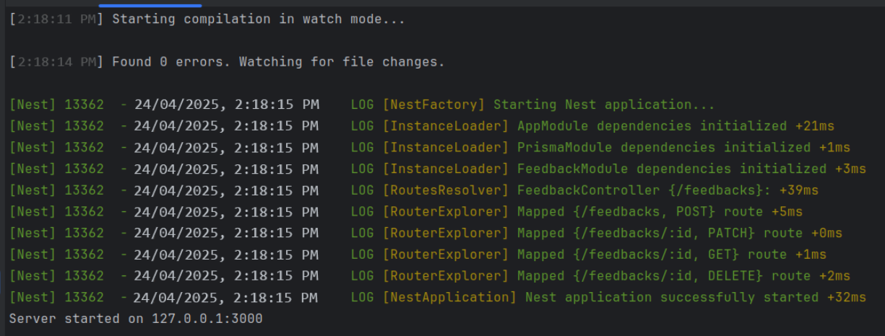
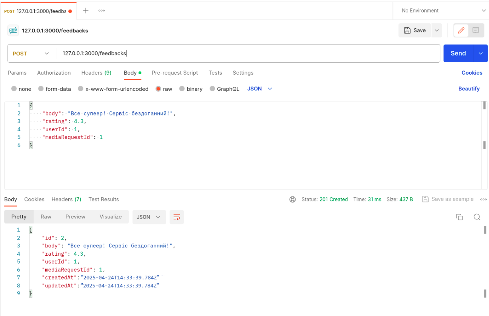
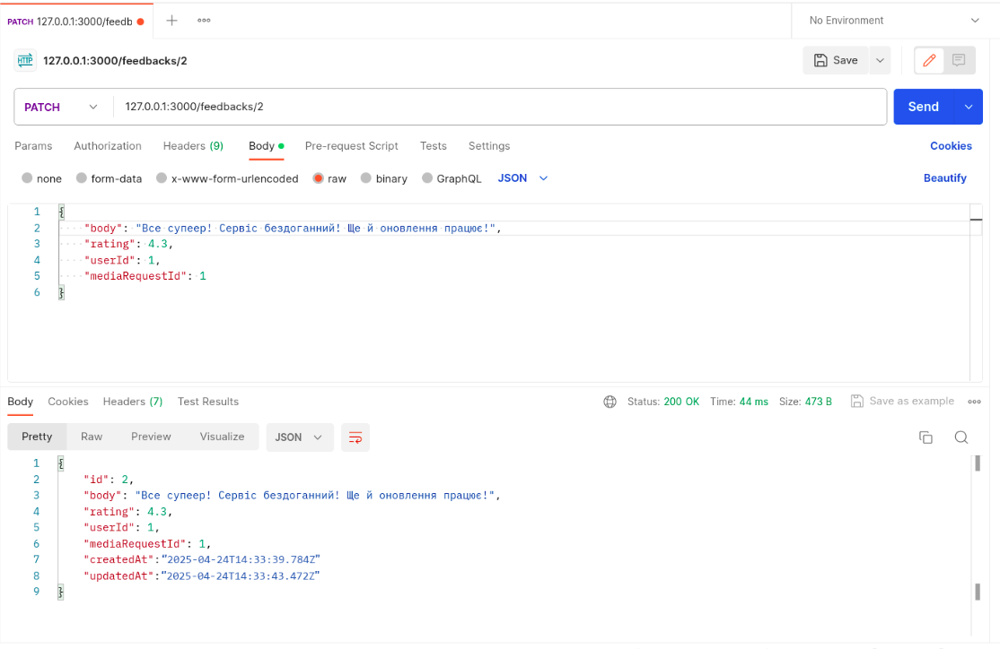
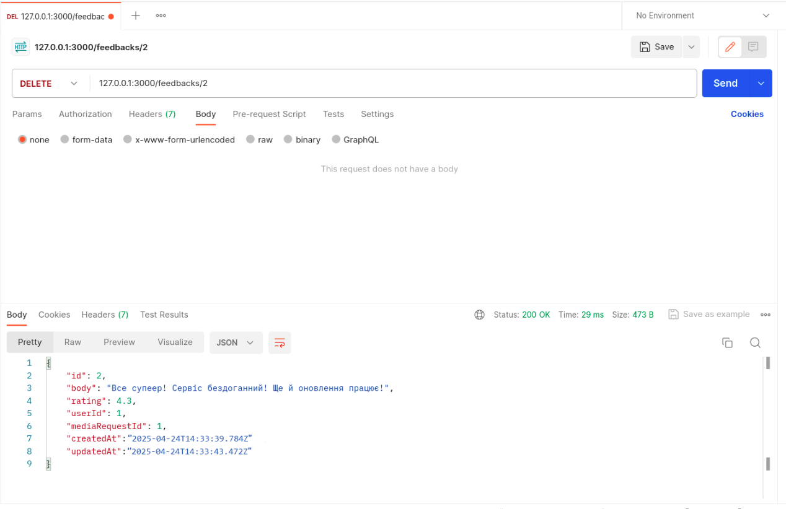
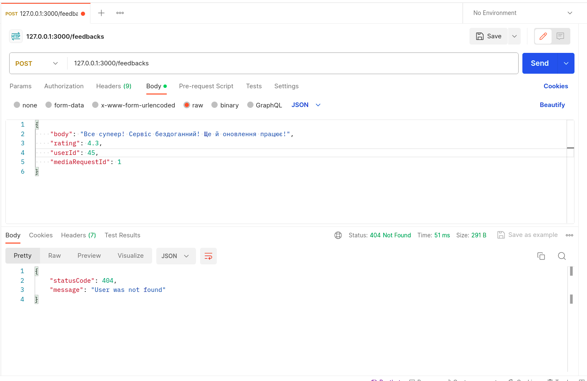
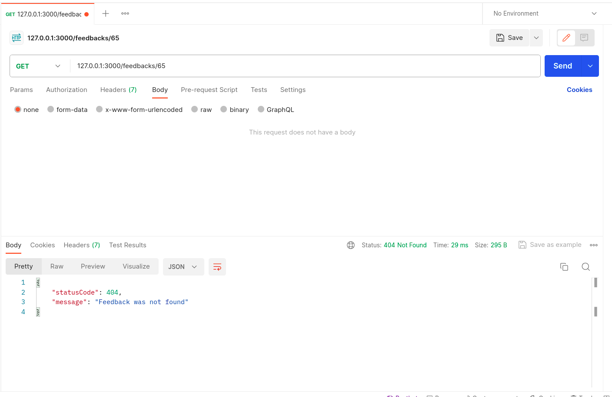

# Тестування працездатності системи

Тестування сервісу проводилося за допомогою Postman.

## Запуск сервера

    

## POST /feedback

    

## PATCH /feedback/:id

    

## GET /feedback/:id

    

## DELETE /feedback/:id

    

## EXCEPTION: User was not found

    

## EXCEPTION: Feedback was not found

    

## EXCEPTION: Media request was not found

    

 