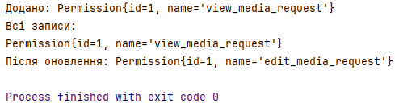
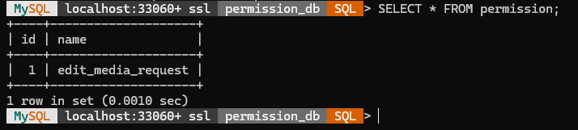

# Permission DB — Структура та реалізація

Цей документ містить **детальний опис** та пояснення всіх кроків для створення та використання бази даних `permission_db` з єдиною таблицею `permission`. Також наведено Java-код, що демонструє підключення до БД та роботу з таблицею через DAO (Data Access Object) патерн.

---

## 1. SQL-скрипт: create_permission_db.sql

```sql
-- Файл: create_permission_db.sql

-- 1) Створюємо базу даних, якщо її ще немає
CREATE DATABASE IF NOT EXISTS permission_db;

-- 2) Перемикаємося на створену базу
USE permission_db;

-- 3) Створюємо таблицю permission:
CREATE TABLE IF NOT EXISTS permission (
    id INT AUTO_INCREMENT PRIMARY KEY,   -- унікальний ідентифікатор дозволу
    name VARCHAR(255) NOT NULL           -- назва дозволу (обов’язкове)
);
```

**Пояснення**  
- **CREATE DATABASE IF NOT EXISTS**: створює схему `permission_db`, якщо вона відсутня.  
- **USE permission_db**: вибирає схему для наступних операцій.  
- Таблиця `permission` має два поля:  
  - `id` — автоінкрементований первинний ключ;  
  - `name` — назва дозволу, не може бути порожньою.

---

## 2. DatabaseConnection.java

```java
package com.example.util;

import java.sql.Connection;
import java.sql.DriverManager;
import java.sql.SQLException;

public class DatabaseConnection {
    // URL підключення до MySQL для permission_db
    private static final String URL = "jdbc:mysql://localhost:3306/permission_db?useSSL=false&serverTimezone=UTC";
    private static final String USER = "root";
    private static final String PASSWORD = "password";

    private static Connection connection;

    private DatabaseConnection() { }

    /**
     * Повертає єдине з’єднання JDBC до permission_db.
     * Якщо з’єднання ще не створене або закрите — створює нове.
     */
    public static Connection getConnection() throws SQLException {
        if (connection == null || connection.isClosed()) {
            connection = DriverManager.getConnection(URL, USER, PASSWORD);
        }
        return connection;
    }
}
```

**Пояснення**  
- Оновлений **URL** вказує на схему `permission_db`.  
- Решта логіки кешування `Connection` аналогічна іншим DAO.

---

## 3. Permission.java (модель)

```java
package com.example.model;

public class Permission {
    private int id;            // зберігає значення AUTO_INCREMENT
    private String name;       // назва дозволу

    public Permission() { }

    public Permission(String name) {
        this.name = name;
    }

    public Permission(int id, String name) {
        this.id = id;
        this.name = name;
    }

    // Геттери і сеттери
    public int getId() { return id; }
    public void setId(int id) { this.id = id; }
    public String getName() { return name; }
    public void setName(String name) { this.name = name; }

    @Override
    public String toString() {
        return "Permission{id=" + id +
               ", name='" + name + ''' +
               '}';
    }
}
```

**Пояснення**  
- POJO-клас для відображення запису таблиці `permission`.  
- Конструктори дозволяють створювати об’єкт з/без `id`.

---

## 4. PermissionDAO.java (інтерфейс)

```java
package com.example.dao;

import com.example.model.Permission;
import java.sql.SQLException;
import java.util.List;

public interface PermissionDAO {
    // Додати новий дозвіл
    void addPermission(Permission permission) throws SQLException;
    // Отримати дозвіл за id
    Permission getPermissionById(int id) throws SQLException;
    // Отримати всі дозволи
    List<Permission> getAllPermissions() throws SQLException;
    // Оновити назву дозволу
    void updatePermission(Permission permission) throws SQLException;
    // Видалити дозвіл за id
    void deletePermission(int id) throws SQLException;
}
```

**Пояснення**  
- Інтерфейс описує CRUD-операції для таблиці `permission`.  
- Розділяє контракти від реалізації.

---

## 5. PermissionDAOImpl.java (реалізація)

```java
package com.example.dao;

import com.example.model.Permission;
import com.example.util.DatabaseConnection;

import java.sql.*;
import java.util.ArrayList;
import java.util.List;

public class PermissionDAOImpl implements PermissionDAO {
    private final Connection conn;

    // Підключення до permission_db
    public PermissionDAOImpl() throws SQLException {
        this.conn = DatabaseConnection.getConnection();
    }

    @Override
    public void addPermission(Permission permission) throws SQLException {
        String sql = "INSERT INTO permission (name) VALUES (?)";
        try (PreparedStatement ps = conn.prepareStatement(sql, Statement.RETURN_GENERATED_KEYS)) {
            ps.setString(1, permission.getName());
            ps.executeUpdate();
            try (ResultSet rs = ps.getGeneratedKeys()) {
                if (rs.next()) {
                    permission.setId(rs.getInt(1));
                }
            }
        }
    }

    @Override
    public Permission getPermissionById(int id) throws SQLException {
        String sql = "SELECT * FROM permission WHERE id = ?";
        try (PreparedStatement ps = conn.prepareStatement(sql)) {
            ps.setInt(1, id);
            try (ResultSet rs = ps.executeQuery()) {
                if (rs.next()) {
                    return new Permission(
                        rs.getInt("id"),
                        rs.getString("name")
                    );
                }
            }
        }
        return null;
    }

    @Override
    public List<Permission> getAllPermissions() throws SQLException {
        List<Permission> list = new ArrayList<>();
        String sql = "SELECT * FROM permission";
        try (Statement st = conn.createStatement();
             ResultSet rs = st.executeQuery(sql)) {
            while (rs.next()) {
                list.add(new Permission(
                    rs.getInt("id"),
                    rs.getString("name")
                ));
            }
        }
        return list;
    }

    @Override
    public void updatePermission(Permission permission) throws SQLException {
        String sql = "UPDATE permission SET name = ? WHERE id = ?";
        try (PreparedStatement ps = conn.prepareStatement(sql)) {
            ps.setString(1, permission.getName());
            ps.setInt(2, permission.getId());
            ps.executeUpdate();
        }
    }

    @Override
    public void deletePermission(int id) throws SQLException {
        String sql = "DELETE FROM permission WHERE id = ?";
        try (PreparedStatement ps = conn.prepareStatement(sql)) {
            ps.setInt(1, id);
            ps.executeUpdate();
        }
    }
}
```

**Пояснення**  
- Використовуються `PreparedStatement` та `RETURN_GENERATED_KEYS`.  
- Методи `getPermissionById` і `getAllPermissions` повертають об’єкти моделі.

---

## 6. Main.java (приклад використання)

```java
package com.example;

import com.example.dao.PermissionDAO;
import com.example.dao.PermissionDAOImpl;
import com.example.model.Permission;

import java.sql.SQLException;
import java.util.List;

public class Main {
    public static void main(String[] args) {
        try {
            PermissionDAO permDao = new PermissionDAOImpl();

            
            Permission perm = new Permission("view_media_request");
            permDao.addPermission(perm);
            System.out.println("Додано дозвіл: " + perm);

            
            List<Permission> perms = permDao.getAllPermissions();
            System.out.println("Всі дозволи:");
            perms.forEach(System.out::println);

            
            perm.setName("edit_media_request");
            permDao.updatePermission(perm);
            System.out.println("Після оновлення: " + permDao.getPermissionById(perm.getId()));

            
            permDao.deletePermission(perm.getId());
            System.out.println("Після видалення залишились:");
            permDao.getAllPermissions().forEach(System.out::println);

        } catch (SQLException e) {
            e.printStackTrace();
        }
    }
}
```

**Пояснення**  
- Аналогічний workflow: **add** → **get all** → **update** → **get by id** → **delete** → **get all**.

---

## Результати

**JAVA**



**SQL**

