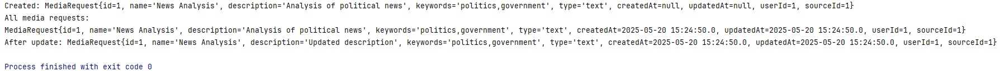
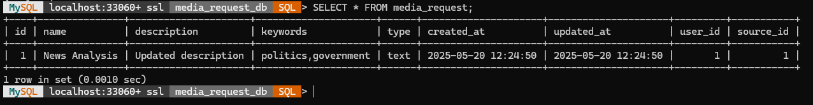

# Media Request DB Project — Повне керівництво.


## 1. SQL: create_media_request_db.sql

```sql
-- media-request-db-project/sql/create_media_request_db.sql

-- 1. Створити схему (якщо не існує)
CREATE DATABASE IF NOT EXISTS media_request_db;

-- 2. Перемкнути контекст на нову базу
USE media_request_db;

-- 3. Визначити структуру таблиці media_request
CREATE TABLE IF NOT EXISTS media_request (
    id INT AUTO_INCREMENT PRIMARY KEY,            -- Унікальний ідентифікатор
    name VARCHAR(255),                            -- Назва запиту
    description VARCHAR(1024),                    -- Опис запиту
    keywords VARCHAR(255),                        -- Ключові слова (розділені комами)
    type VARCHAR(255),                            -- Тип контенту (video, audio, text)
    created_at DATETIME DEFAULT CURRENT_TIMESTAMP,-- Дата створення
    updated_at DATETIME DEFAULT CURRENT_TIMESTAMP -- Дата останнього оновлення
        ON UPDATE CURRENT_TIMESTAMP,
    user_id INT,                                  -- Логічне посилання на користувача
    source_id INT                                 -- Логічне посилання на джерело
);
```

**Пояснення**  
- `AUTO_INCREMENT PRIMARY KEY` автоматично генерує унікальний `id`.  
- `created_at` і `updated_at` фіксують час, коли запис створено і коли він востаннє змінювався.  
- `user_id` і `source_id` залишаються без зовнішніх ключів, щоб таблиця була незалежною.

---

## 2. Підключення до БД: DatabaseConnection.java

```java
// media-request-db-project/src/com/example/util/DatabaseConnection.java
package com.example.util;

import java.sql.Connection;
import java.sql.DriverManager;
import java.sql.SQLException;

/**
 * Singleton-клас для отримання JDBC-з’єднання з базою media_request_db.
 */
public class DatabaseConnection {
    private static final String URL =
        "jdbc:mysql://localhost:3306/media_request_db"
      + "?allowPublicKeyRetrieval=true"
      + "&useSSL=false"
      + "&serverTimezone=UTC";
    private static final String USER = "root";                   // MySQL користувач
    private static final String PASS = "your_password_here";     // Пароль

    private static Connection connection;

    private DatabaseConnection() { }

    /**
     * Повертає активне з’єднання або створює нове, якщо ще не існувало.
     */
    public static Connection getConnection() throws SQLException {
        if (connection == null || connection.isClosed()) {
            // allowPublicKeyRetrieval=true необхідний для MySQL 8+ з caching_sha2_password
            connection = DriverManager.getConnection(URL, USER, PASS);
        }
        return connection;
    }
}
```

**Пояснення**  
- Використовуємо `allowPublicKeyRetrieval=true` для вирішення помилки Public Key Retrieval.  
- `useSSL=false` відключає SSL, зручно для розробки.  
- `serverTimezone=UTC` уникає помилок з часовими зонами.

---

## 3. POJO-модель: MediaRequest.java

```java
// media-request-db-project/src/com/example/model/MediaRequest.java
package com.example.model;

import java.sql.Timestamp;

/**
 * Модель об’єкта MediaRequest, що відображає рядок таблиці.
 */
public class MediaRequest {
    private int id;
    private String name;
    private String description;
    private String keywords;
    private String type;
    private Timestamp createdAt;
    private Timestamp updatedAt;
    private int userId;
    private int sourceId;

    public MediaRequest() { }

    /**
     * Конструктор для вставки нового запису (без id, createdAt, updatedAt).
     */
    public MediaRequest(String name,
                        String description,
                        String keywords,
                        String type,
                        int userId,
                        int sourceId) {
        this.name = name;
        this.description = description;
        this.keywords = keywords;
        this.type = type;
        this.userId = userId;
        this.sourceId = sourceId;
    }

    /**
     * Конструктор для читання з БД (з усіма полями).
     */
    public MediaRequest(int id,
                        String name,
                        String description,
                        String keywords,
                        String type,
                        Timestamp createdAt,
                        Timestamp updatedAt,
                        int userId,
                        int sourceId) {
        this(name, description, keywords, type, userId, sourceId);
        this.id = id;
        this.createdAt = createdAt;
        this.updatedAt = updatedAt;
    }

    // ————— Геттери та сеттери —————

    public int getId() { return id; }
    public void setId(int id) { this.id = id; }

    public String getName() { return name; }
    public void setName(String name) { this.name = name; }

    public String getDescription() { return description; }
    public void setDescription(String description) { this.description = description; }

    public String getKeywords() { return keywords; }
    public void setKeywords(String keywords) { this.keywords = keywords; }

    public String getType() { return type; }
    public void setType(String type) { this.type = type; }

    public Timestamp getCreatedAt() { return createdAt; }
    public void setCreatedAt(Timestamp createdAt) { this.createdAt = createdAt; }

    public Timestamp getUpdatedAt() { return updatedAt; }
    public void setUpdatedAt(Timestamp updatedAt) { this.updatedAt = updatedAt; }

    public int getUserId() { return userId; }
    public void setUserId(int userId) { this.userId = userId; }

    public int getSourceId() { return sourceId; }
    public void setSourceId(int sourceId) { this.sourceId = sourceId; }

    @Override
    public String toString() {
        return "MediaRequest{" +
               "id=" + id +
               ", name='" + name + '\'' +
               ", description='" + description + '\'' +
               ", keywords='" + keywords + '\'' +
               ", type='" + type + '\'' +
               ", createdAt=" + createdAt +
               ", updatedAt=" + updatedAt +
               ", userId=" + userId +
               ", sourceId=" + sourceId +
               '}';
    }
}
```

**Пояснення**  
- Наявність геттерів/сеттерів необхідна для компіляції та роботи DAO.  
- `Timestamp` використовується для точного часу.

---

## 4. DAO-інтерфейс: MediaRequestDAO.java

```java
// media-request-db-project/src/com/example/dao/MediaRequestDAO.java
package com.example.dao;

import com.example.model.MediaRequest;
import java.sql.SQLException;
import java.util.List;

/**
 * Контракт CRUD-операцій для таблиці media_request.
 */
public interface MediaRequestDAO {
    void addMediaRequest(MediaRequest mr) throws SQLException;
    MediaRequest getMediaRequestById(int id) throws SQLException;
    List<MediaRequest> getAllMediaRequests() throws SQLException;
    void updateMediaRequest(MediaRequest mr) throws SQLException;
    void deleteMediaRequest(int id) throws SQLException;
}
```

**Пояснення**  
- Обов’язкові методи для реалізації Create, Read, Update, Delete.

---

## 5. Реалізація DAO: MediaRequestDAOImpl.java

```java
// media-request-db-project/src/com/example/dao/MediaRequestDAOImpl.java
package com.example.dao;

import com.example.model.MediaRequest;
import com.example.util.DatabaseConnection;

import java.sql.*;
import java.util.ArrayList;
import java.util.List;

/**
 * JDBC-реалізація CRUD-операцій для media_request.
 */
public class MediaRequestDAOImpl implements MediaRequestDAO {
    private final Connection conn;

    public MediaRequestDAOImpl() throws SQLException {
        this.conn = DatabaseConnection.getConnection();
    }

    @Override
    public void addMediaRequest(MediaRequest mr) throws SQLException {
        String sql = "INSERT INTO media_request " +
                     "(name,description,keywords,type,user_id,source_id) VALUES (?,?,?,?,?,?)";
        try (PreparedStatement ps = conn.prepareStatement(
                sql, Statement.RETURN_GENERATED_KEYS)) {
            ps.setString(1, mr.getName());
            ps.setString(2, mr.getDescription());
            ps.setString(3, mr.getKeywords());
            ps.setString(4, mr.getType());
            ps.setInt(5, mr.getUserId());
            ps.setInt(6, mr.getSourceId());
            ps.executeUpdate();
            try (ResultSet rs = ps.getGeneratedKeys()) {
                if (rs.next()) mr.setId(rs.getInt(1));
            }
        }
    }

    @Override
    public MediaRequest getMediaRequestById(int id) throws SQLException {
        String sql = "SELECT * FROM media_request WHERE id = ?";
        try (PreparedStatement ps = conn.prepareStatement(sql)) {
            ps.setInt(1, id);
            try (ResultSet rs = ps.executeQuery()) {
                if (rs.next()) {
                    return new MediaRequest(
                        rs.getInt("id"),
                        rs.getString("name"),
                        rs.getString("description"),
                        rs.getString("keywords"),
                        rs.getString("type"),
                        rs.getTimestamp("created_at"),
                        rs.getTimestamp("updated_at"),
                        rs.getInt("user_id"),
                        rs.getInt("source_id")
                    );
                }
            }
        }
        return null;
    }

    @Override
    public List<MediaRequest> getAllMediaRequests() throws SQLException {
        List<MediaRequest> list = new ArrayList<>();
        String sql = "SELECT * FROM media_request";
        try (Statement st = conn.createStatement();
             ResultSet rs = st.executeQuery(sql)) {
            while (rs.next()) {
                list.add(new MediaRequest(
                    rs.getInt("id"),
                    rs.getString("name"),
                    rs.getString("description"),
                    rs.getString("keywords"),
                    rs.getString("type"),
                    rs.getTimestamp("created_at"),
                    rs.getTimestamp("updated_at"),
                    rs.getInt("user_id"),
                    rs.getInt("source_id")
                ));
            }
        }
        return list;
    }

    @Override
    public void updateMediaRequest(MediaRequest mr) throws SQLException {
        String sql = "UPDATE media_request SET " +
                     "name=?, description=?, keywords=?, type=?, user_id=?, source_id=? " +
                     "WHERE id = ?";
        try (PreparedStatement ps = conn.prepareStatement(sql)) {
            ps.setString(1, mr.getName());
            ps.setString(2, mr.getDescription());
            ps.setString(3, mr.getKeywords());
            ps.setString(4, mr.getType());
            ps.setInt(5, mr.getUserId());
            ps.setInt(6, mr.getSourceId());
            ps.setInt(7, mr.getId());
            ps.executeUpdate();
        }
    }

    @Override
    public void deleteMediaRequest(int id) throws SQLException {
        String sql = "DELETE FROM media_request WHERE id = ?";
        try (PreparedStatement ps = conn.prepareStatement(sql)) {
            ps.setInt(1, id);
            ps.executeUpdate();
        }
    }
}
```

**Пояснення**  
- `addMediaRequest` повертає згенерований ключ.  
- `getAllMediaRequests` збирає всі рядки в список.  
- `updateMediaRequest` і `deleteMediaRequest` виконують оновлення та видалення відповідно.

---

## 6. Демонстрація: Main.java

```java
// media-request-db-project/src/com/example/Main.java
package com.example;

import com.example.dao.MediaRequestDAO;
import com.example.dao.MediaRequestDAOImpl;
import com.example.model.MediaRequest;

import java.sql.SQLException;
import java.util.List;

/**
 * Приклад виконання CRUD-операцій над таблицею media_request.
 */
public class Main {
    public static void main(String[] args) {
        try {
            MediaRequestDAO dao = new MediaRequestDAOImpl();

            // CREATE
            MediaRequest mr = new MediaRequest(
                "News Analysis",
                "Analyze latest news",
                "news,analysis,politics",
                "text",
                1,  // user_id
                1   // source_id
            );
            dao.addMediaRequest(mr);
            System.out.println("Created: " + mr);

            // READ ALL
            List<MediaRequest> all = dao.getAllMediaRequests();
            System.out.println("All media requests:");
            all.forEach(System.out::println);

            // UPDATE
            mr.setDescription("Updated description for news analysis");
            dao.updateMediaRequest(mr);
            System.out.println("After update: " + dao.getMediaRequestById(mr.getId()));

            // DELETE
            dao.deleteMediaRequest(mr.getId());
            System.out.println("After delete:");
            dao.getAllMediaRequests().forEach(System.out::println);

        } catch (SQLException e) {
            e.printStackTrace();
        }
    }
}
```

**Пояснення**  
1. **CREATE**: вставка нового запису, отримання `id`.  
2. **READ ALL**: вивід повного списку.  
3. **UPDATE**: зміна полів і перевірка результату.  
4. **DELETE**: видалення і фінальний вивід.

---

## Результати

**Результат JAVA**



**Результат SQL Shell**


